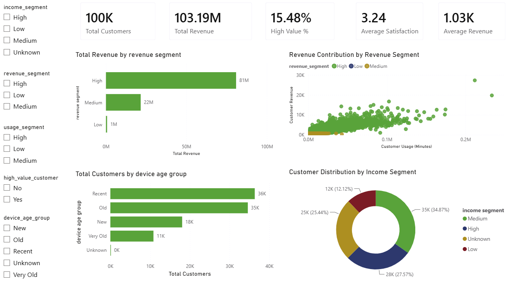
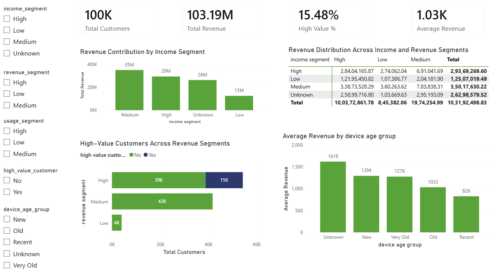
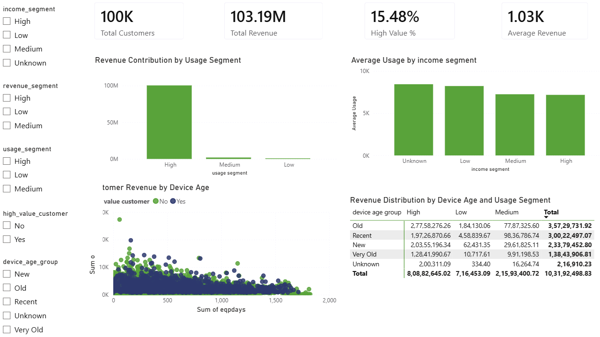
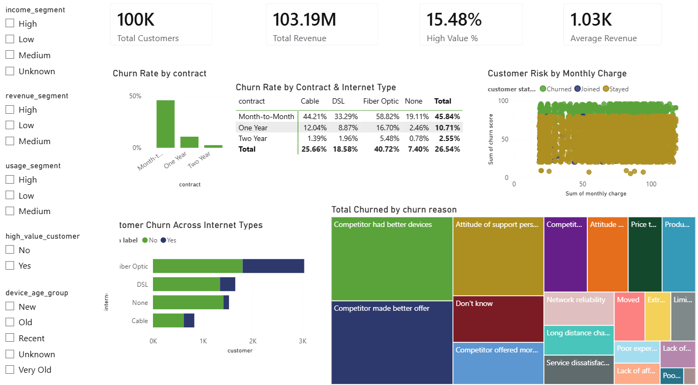
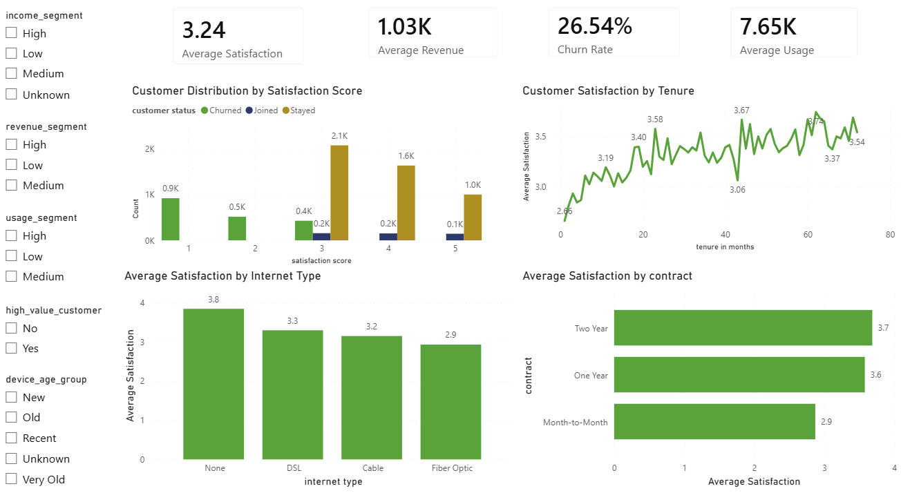
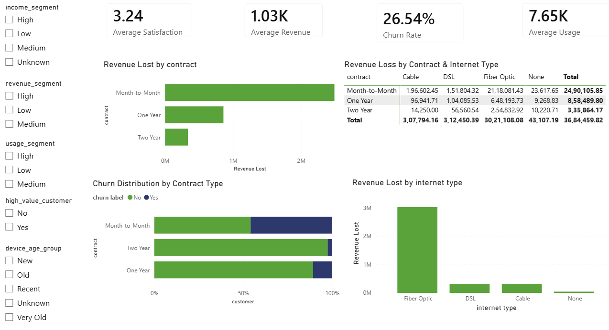

# 📊 Telecom Customer Intelligence Platform

An end-to-end **Telecom Customer Analytics** project that transforms raw telecom customer data into actionable business insights using **Python, PostgreSQL, SQL, Power BI, and GitHub**. The project follows a real-world analytics workflow from exploratory data analysis and data modeling to executive dashboards and strategic business recommendations.

---

# 🎯 Business Problem

Telecommunication companies often experience significant revenue loss due to customer churn, ineffective customer segmentation, and limited visibility into customer behavior. Business teams require a centralized analytics solution to understand customer value, identify churn drivers, monitor business KPIs, and make data-driven retention decisions.
This project simulates the role of a **Business/Data Analyst** by designing an end-to-end analytics solution that converts raw telecom data into executive-ready dashboards and strategic business recommendations.

---

# 🎯 Business Objectives

- Identify customers at high risk of churn.
- Analyze customer segmentation and revenue distribution.
- Measure customer satisfaction and usage behavior.
- Discover key factors influencing customer churn.
- Quantify revenue loss caused by customer attrition.
- Build interactive dashboards for business monitoring.
- Recommend business strategies to improve customer retention and maximize revenue.

---

# 🔄 Project Workflow

```text
Raw Telecom Dataset
        │
        ▼
Exploratory Data Analysis (Python)
        │
        ▼
Data Cleaning & Feature Engineering
        │
        ▼
PostgreSQL Data Warehouse
        │
        ▼
Intermediate Data Modeling
        │
        ▼
Analytics Marts & Business KPIs
        │
        ▼
Interactive Power BI Dashboard
        │
        ▼
Business Insights & Strategic Recommendations
```

---

# 🛠️ Tech Stack

| Category | Technologies |
|-----------|--------------|
| Programming | Python |
| Data Analysis | Pandas, NumPy |
| Visualization | Matplotlib, Seaborn |
| Database | PostgreSQL |
| Query Language | SQL |
| Business Intelligence | Power BI |
| Version Control | Git & GitHub |

---

# 📈 Dashboard Preview


## Executive Overview



---

## Customer Segmentation



---

## Revenue & Usage Analysis



---

## Customer Churn Analysis



---

## Customer Experience



---

## Business Recommendations



---

# 📊 Key Business KPIs

- Total Customers
- Total Revenue
- Average Revenue Per Customer
- Churn Rate
- High Value Customers
- Revenue Lost
- Average Customer Satisfaction
- Average Customer Usage

---

# 📌 Dashboard Highlights

The Power BI dashboard consists of six analytical pages:

- Executive Overview
- Customer Segmentation
- Revenue & Usage Analysis
- Customer Churn Analysis
- Customer Experience Analysis
- Business Recommendations

### Dashboard Features

- Interactive KPI Cards
- Dynamic Slicers
- Drill-down Analysis
- Business KPI Monitoring
- Cross-filtering
- Executive Storytelling Dashboard
- Customer Segmentation
- Revenue Analysis
- Churn Analysis
- Business Recommendation Dashboard

---

# 📒 Exploratory Data Analysis

The complete exploratory data analysis is available in the notebook below.

📓 **EDA Notebook**

➡️ [Telecom Customer EDA Notebook](notebooks/Telecom_Customer_EDA.ipynb)

The notebook includes:

- Data Understanding
- Data Cleaning
- Missing Value Analysis
- Exploratory Data Analysis
- Customer Segmentation
- Revenue Analysis
- Churn Analysis
- Feature Engineering
- Business Insights
- Data Visualization

---

# 🗄️ SQL Analytics Pipeline

The SQL implementation follows a layered analytics architecture consisting of:

- Raw Data Validation
- Data Cleaning
- Staging Layer
- Intermediate Layer
- Analytics Marts
- Business KPI Development
- Dashboard Views
- Advanced Analytics Queries

---

# 💡 Key Business Insights

- Month-to-Month contract customers exhibit the highest churn rate.
- Fiber Optic customers contribute the highest revenue loss.
- Customer satisfaction improves with longer customer tenure.
- High-value customers contribute a significant share of total revenue.
- Device age influences customer revenue generation.
- Long-term contracts improve customer retention.
- Customer behavior varies significantly across revenue and usage segments.

---

# 🚀 Business Recommendations

Based on the analysis, the following strategies are recommended:

- Encourage Month-to-Month customers to migrate to long-term contracts.
- Improve Fiber Optic customer experience through targeted service enhancements.
- Launch proactive retention campaigns for customers with high churn probability.
- Prioritize high-value customer retention initiatives.
- Introduce loyalty programs for long-tenure customers.
- Continuously monitor business KPIs using the Power BI dashboard.

---

# 📂 Repository Structure

```text
Telecom-Customer-Intelligence/
│
├── database/
│   ├── SQL scripts
│   ├── Intermediate Layer
│   ├── Analytics Layer
│   ├── Business KPIs
│   └── Dashboard Views
│
├── docs/
│
├── images/
│   ├── executive_overview.png
│   ├── customer_segmentation.png
│   ├── revenue_usage.png
│   ├── customer_churn.png
│   ├── customer_experience.png
│   └── business_recommendations.png
│
├── notebooks/
│   └── Telecom_Customer_EDA.ipynb
│
├── powerbi/
│   └── telecom_customer_dashboard.pbix
│
├── presentation/
│   └── Telecom_Customer_Intelligence_Presentation.pptx
│
├── README.md
│
└── requirements.txt
```

---

# 📁 Project Files

| File | Description |
|------|-------------|
| 📓 [EDA Notebook](notebooks/Telecom_Customer_EDA.ipynb) | Exploratory Data Analysis |
| 📊 [Power BI Dashboard](powerbi/telecom_customer_dashboard.pbix) | Interactive Business Intelligence Dashboard |
| 📑 [Presentation](presentation/) | Final Business Presentation |
| 🗄️ [SQL Scripts](database/) | Database Design, Analytics Queries & KPIs |
| 📚 [Documentation](docs/) | Project Documentation |

---

# 🔮 Future Improvements

- Deploy dashboard using Power BI Service.
- Integrate Machine Learning based churn prediction.
- Automate ETL workflows.
- Enable real-time dashboard refresh.
- Develop executive reporting automation.

---

# 🎯 Business Impact

This project demonstrates how modern data analytics can support strategic decision-making by:

- Identifying customers with high churn risk.
- Quantifying revenue loss across customer segments.
- Improving customer retention through data-driven strategies.
- Providing executives with interactive KPI dashboards.
- Enabling proactive business decisions using analytics.

---

# 👨‍💻 Author

**Kanishka Tulya**

MCA Student | Data Analytics | Business Intelligence | SQL | Python | PostgreSQL | Power BI

---

⭐ *If you found this project interesting, consider giving it a star!*
