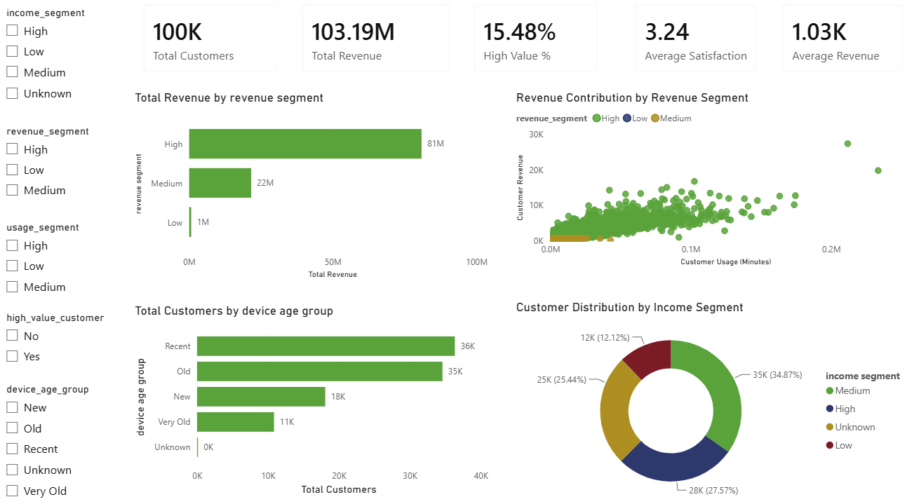
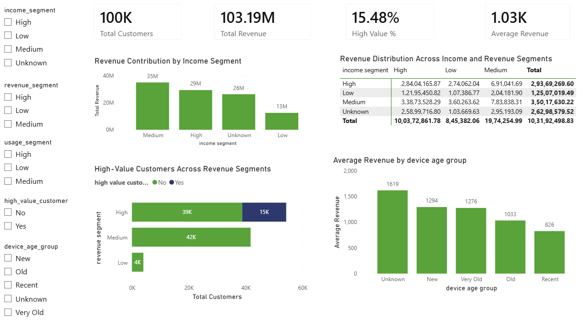
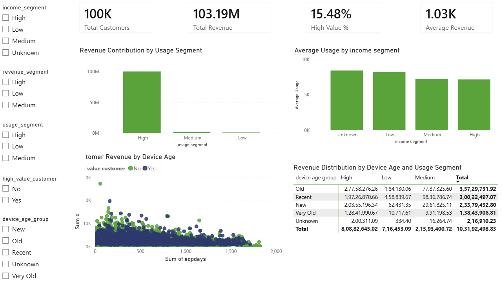
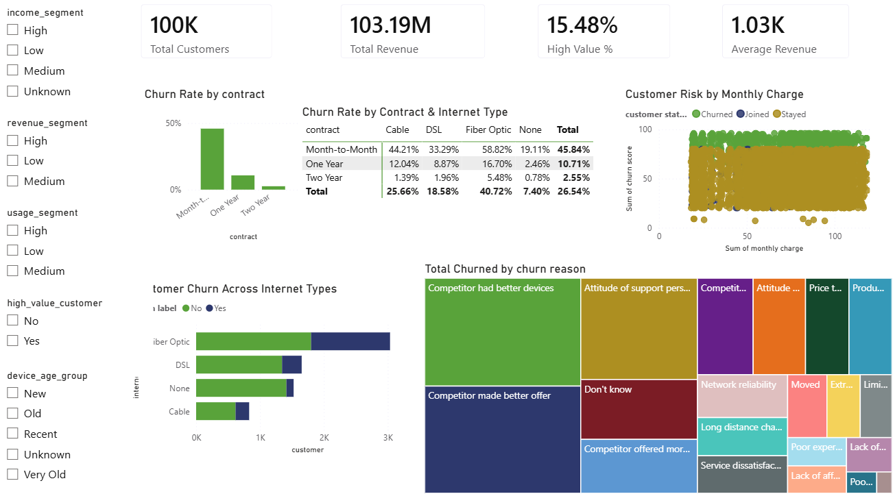
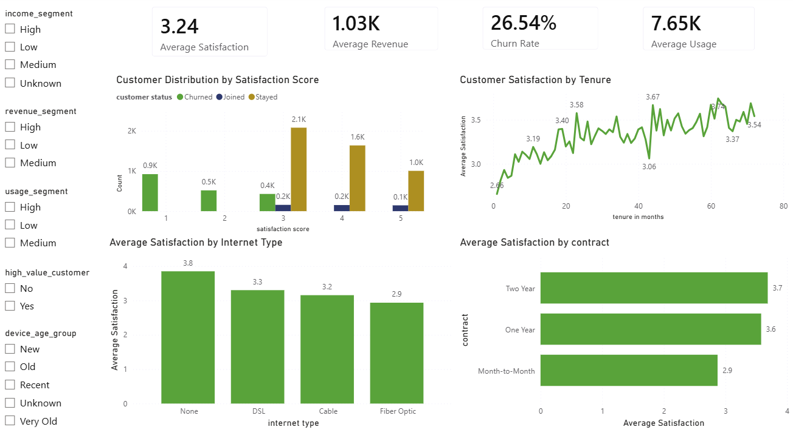
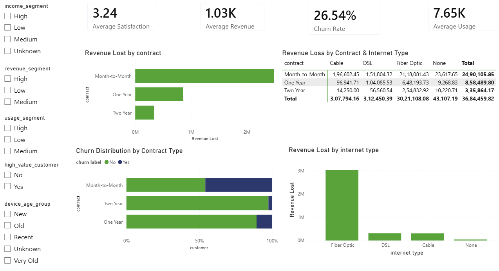

#  Telecom Customer Intelligence Platform

## Project Highlights

• End-to-end Telecom Customer Analytics solution using 4 telecom datasets (~307K+ records) covering customer demographics, usage, revenue, services, and churn data.
• Layered PostgreSQL data warehouse following Raw → Staging → Intermediate → Analytics architecture.
• Data validation, relationship checks, data cleaning, transformation and feature engineering to create analysis-ready datasets.
• Analytical models integrating customer, usage, service, and churn data for business reporting and KPI analysis.
• Built interactive 6 Power BI dashboards for Executive Overview, Customer Segmentation, Customer Experience, Revenue & Usage, and Customer Churn Analysis.
• Developed business KPIs including Churn Rate, Customer Lifetime Value (CLTV), Customer Satisfaction, Revenue, High-Value Customers, Usage Segments, and Revenue Segments.
• Delivered business recommendations to support customer retention, revenue optimization, customer segmentation, and customer experience improvement.

---

#  Business Problem

- Identified key telecom business challenges including customer churn, poor segmentation, and revenue loss.
- Built an end-to-end analytics solution to transform raw telecom data into actionable business insights.
- Developed executive dashboards to monitor customer behavior, KPIs, and business performance.
- Analyzed churn drivers and customer value to support data-driven retention strategies.
- Enabled business teams to make informed decisions through centralized analytics and reporting.

---

#  Business Objectives

- Identify customers at high risk of churn.
- Analyze customer segmentation and revenue distribution.
- Measure customer satisfaction and usage behavior.
- Discover key factors influencing customer churn.
- Quantify revenue loss caused by customer attrition.
- Build interactive dashboards for business monitoring.
- Recommend business strategies to improve customer retention and maximize revenue.

---

#  Project Workflow

```text
Raw Telecom Dataset
        │
        ▼
Exploratory Data Analysis (Python)
        │
        ▼
Data Cleaning & Feature Engineering
        │
        ▼
PostgreSQL Data Warehouse
        │
        ▼
Intermediate Data Modeling
        │
        ▼
Analytics Marts & Business KPIs
        │
        ▼
Interactive Power BI Dashboard
        │
        ▼
Business Insights & Strategic Recommendations
```

---

#  Tech Stack

| Category | Technologies |
|-----------|--------------|
| Programming | Python |
| Data Analysis | Pandas, NumPy |
| Visualization | Matplotlib, Seaborn |
| Database | PostgreSQL |
| Query Language | SQL |
| Business Intelligence | Power BI |
| Version Control | Git & GitHub |

---

# Dashboard Preview


## Executive Overview



---

## Customer Segmentation



---

## Revenue & Usage Analysis



---

## Customer Churn Analysis



---

## Customer Experience



---

## Business Recommendations



---

# Key Business KPIs

- Total Customers
- Total Revenue
- Average Revenue Per Customer
- Churn Rate
- High Value Customers
- Revenue Lost
- Average Customer Satisfaction
- Average Customer Usage

---

#  Dashboard Highlights

The Power BI dashboard consists of six analytical pages:

- Executive Overview
- Customer Segmentation
- Revenue & Usage Analysis
- Customer Churn Analysis
- Customer Experience Analysis
- Business Recommendations

### Dashboard Features

- Interactive KPI Cards
- Dynamic Slicers
- Drill-down Analysis
- Business KPI Monitoring
- Cross-filtering
- Executive Storytelling Dashboard
- Customer Segmentation
- Revenue Analysis
- Churn Analysis
- Business Recommendation Dashboard

---

#  Exploratory Data Analysis

The complete exploratory data analysis is available in the notebook below.

 **EDA Notebook**

 [Telecom Customer EDA Notebook](notebooks/Telecom_Customer_EDA.ipynb)

The notebook includes:

- Data Understanding
- Data Cleaning
- Missing Value Analysis
- Exploratory Data Analysis
- Customer Segmentation
- Revenue Analysis
- Churn Analysis
- Feature Engineering
- Business Insights
- Data Visualization

---

#  SQL Analytics Pipeline

The SQL implementation follows a layered analytics architecture consisting of:

- Raw Data Validation
- Data Cleaning
- Staging Layer
- Intermediate Layer
- Analytics Marts
- Business KPI Development
- Dashboard Views
- Advanced Analytics Queries

---

#  Key Business Insights

- Month-to-Month contract customers exhibit the highest churn rate.
- Fiber Optic customers contribute the highest revenue loss.
- Customer satisfaction improves with longer customer tenure.
- High-value customers contribute a significant share of total revenue.
- Device age influences customer revenue generation.
- Long-term contracts improve customer retention.
- Customer behavior varies significantly across revenue and usage segments.

---

#  Business Recommendations

Based on the analysis, the following strategies are recommended:

- Encourage Month-to-Month customers to migrate to long-term contracts.
- Improve Fiber Optic customer experience through targeted service enhancements.
- Launch proactive retention campaigns for customers with high churn probability.
- Prioritize high-value customer retention initiatives.
- Introduce loyalty programs for long-tenure customers.
- Continuously monitor business KPIs using the Power BI dashboard.

---

#  Repository Structure

```text
Telecom-Customer-Intelligence/
│
├── database/
│   ├── SQL scripts
│   ├── Intermediate Layer
│   ├── Analytics Layer
│   ├── Business KPIs
│   └── Dashboard Views
│
├── docs/
│
├── images/
│   ├── executive_overview.png
│   ├── customer_segmentation.png
│   ├── revenue_usage.png
│   ├── customer_churn.png
│   ├── customer_experience.png
│   └── business_recommendations.png
│
├── notebooks/
│   └── Telecom_Customer_EDA.ipynb
│
├── powerbi/
│   └── telecom_customer_dashboard.pbix
│
├── presentation/
│   └── Telecom_Customer_Intelligence_Presentation.pptx
│
├── README.md
│
└── requirements.txt
```

---

#  Project Files

| File | Description |
|------|-------------|
|  [EDA Notebook](notebooks/Telecom_Customer_EDA.ipynb) | Exploratory Data Analysis |
|  [Power BI Dashboard](powerbi/telecom_customer_dashboard.pbix) | Interactive Business Intelligence Dashboard |
|  [Presentation](presentation/) | Final Business Presentation |
|  [SQL Scripts](database/) | Database Design, Analytics Queries & KPIs |
|  [Documentation](docs/) | Project Documentation |

---

#  Future Improvements

- Deploy dashboard using Power BI Service.
- Integrate Machine Learning based churn prediction.
- Automate ETL workflows.
- Enable real-time dashboard refresh.
- Develop executive reporting automation.

---

#  Business Impact

This project demonstrates how modern data analytics can support strategic decision-making by:

- Identifying customers with high churn risk.
- Quantifying revenue loss across customer segments.
- Improving customer retention through data-driven strategies.
- Providing executives with interactive KPI dashboards.
- Enabling proactive business decisions using analytics.

---

#  Author

**Kanishka Tulya**

MCA Student | Data Analytics | Business Intelligence | SQL | Python | PostgreSQL | Power BI

---

